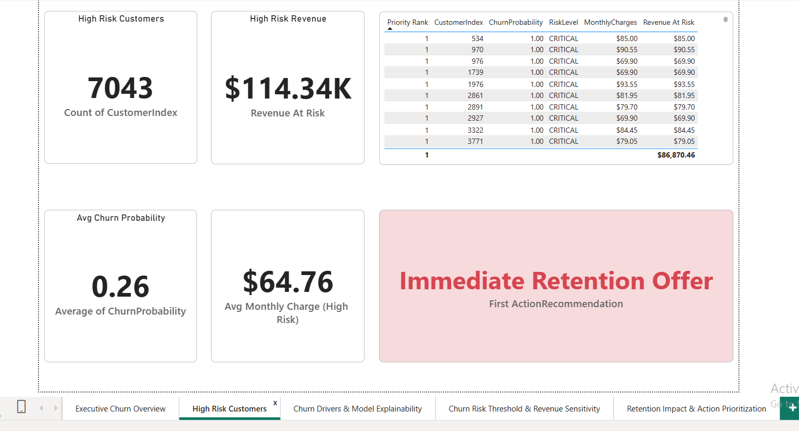
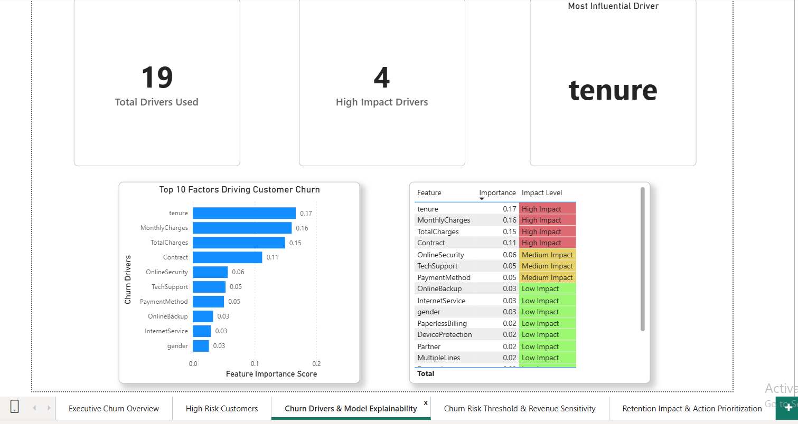
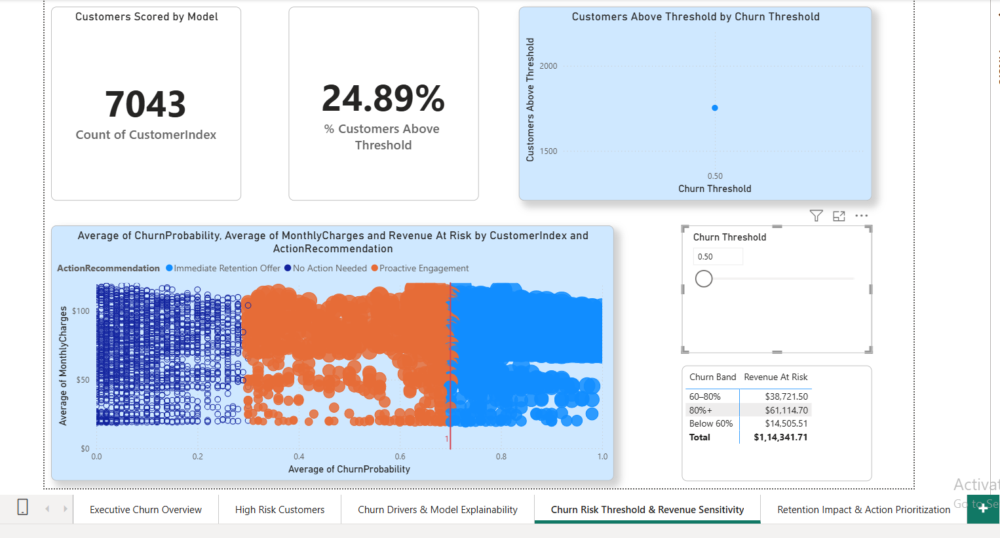
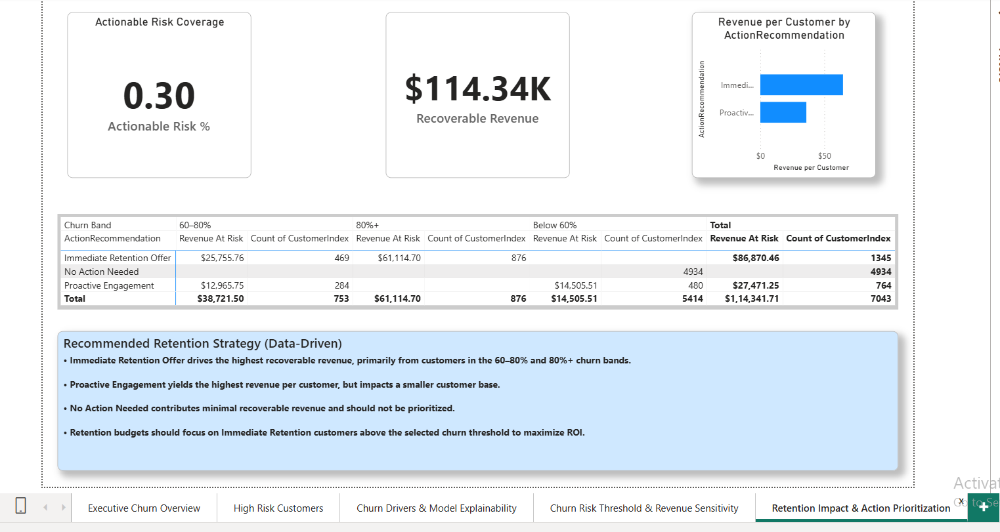

🚀 CUSTOMER CHURN INTELLIGENCE SYSTEM
-
📌 OVERVIEW
-
This project is an end-to-end Customer Churn Intelligence System that combines:

● Machine Learning (Random Forest)

● Custom churn threshold optimization (0.30)

● Risk segmentation (LOW / MEDIUM / CRITICAL)

● Revenue at Risk analysis

● Interactive Power BI dashboard

The goal is not just prediction — but actionable business decision support.

🎯 BUSINESS OBJECTIVE
-
Customer churn directly reduces recurring revenue.

Instead of using the default 0.50 probability threshold, this project applies a 0.30 optimized threshold to:

● Increase churn detection recall

● Identify high-risk customers earlier

● Improve retention planning

● Protect revenue proactively

This shifts the system from a prediction model → to a revenue protection engine.

🛠 TECH STACK
-
● Python

● Pandas

● NumPy

● Scikit-Learn

● Power BI

🧠 MACHINE LEARNING PIPELINE
-
1️⃣ DATA CLEANING
-

● Missing value imputation

  • Median (numerical)
  • Mode (categorical)
  
● Label Encoding for categorical variables

2️⃣ TRAIN-TEST SPLIT
-

● 25% test data

● Stratified sampling to preserve churn distribution

3️⃣ MODEL
-

● Random Forest Classifier

● class_weight="balanced" (handles class imbalance)

4️⃣ PROFESSIONAL THRESHOLD OPTIMIZATION
-

● Default threshold (0.50) replaced with 0.30

● Improves recall for churn detection

● Captures more potential churners early

5️⃣ FEATURE IMPORTANCE
-

Top churn drivers identified:

 • tenure
 
 • monthly charges
 
 • contract

RISK SEGMENT LOGIC
-

Customers are categorized based on predicted churn probability:

🔴 CRITICAL → Probability ≥ 0.70

🟠 MEDIUM → 0.30 ≤ Probability < 0.70

🟢 LOW → Probability < 0.30

This enables actionable retention strategies.

REVENUE IMPACT
-

Revenue at Risk is calculated using predicted churn probability.

The system enables:

● Action-based segmentation

● ROI-focused retention planning

● Strategic resource allocation

📊 DASHBOARD CAPABILITIES
-

The Power BI dashboard includes:

➠ EXECUTIVE CHURN OVERVIEW

!([EXECUTIVE CHURN OVERVIEW](assets/executive_churn_overview.png)

➠ HIGH RISK CUSTOMERS ANALYSIS

➠ CHURN DRIVER AND MODEL EXPLAINABILITY

➠ CHURN RISK THRESHOLD & REVENUE SENSITIVITY

➠ RETENTION IMPACT & ACTION PRIORITIZATION

  
  
📂 PROJECT STRUCTURE
-

customer-churn-intelligence-system/

│

├── data/          → Raw dataset

├── src/           → ML pipeline script

├── dashboard/     → Power BI file

├── results/       → Model outputs

├── requirements.txt

└── README.md

▶️ How To Run

1️⃣ Install Dependencies

pip install -r requirements.txt

2️⃣ Run Model

python src/churn_prediction.py

Outputs will be saved inside the results/ folder.
